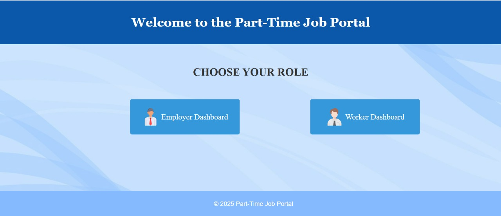
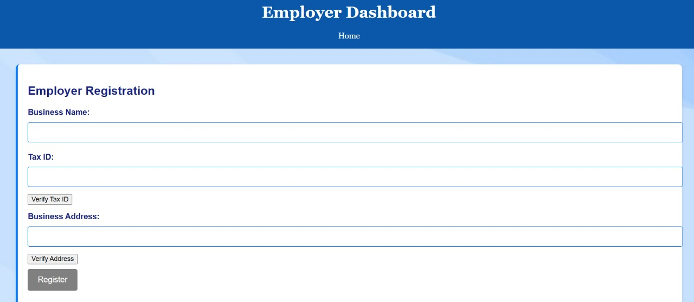

# Buff

**PART-TIME JOB PORTAL**

TEAM NAME : BUFF

TEAM MEMBERS 

ATHENA P DINESH -(SOE)CUSAT
MARIYAM -(SOE)CUSAT
ANUSREE.P-(SOE)CUSAT

PROJECT LINK :

PROJECT DESCRIPTION :

The Part-Time Job Portal is a profit-driven platform connecting employers with job seekers for part-time opportunities. Employers can post job listings and pay the designated salary upfront, which is held by the admin. A small service fee is deducted, and the remaining amount is allocated to the hired employee. Job seekers can explore and apply for suitable positions through a user-friendly interface. This structured payment system ensures a seamless and efficient hiring process.

PROBLEM STATEMENT 
problem:-
College students struggle to find legitimate, well-paying part-time jobs due to unverified employers, low wages, and payment issues. Traditional job search methods, such as local services and informal referrals, often lead to unreliable work opportunities and delayed or unfair payments. Employers face challenges in hiring temporary manpower efficiently. Existing platforms lack proper verification, leading to fraud and unreliable transactions.
solution :-
This platform ensures verified job listings, fair wages, and transparent payments, connecting employers with college students seeking reliable part-time work.The platform ensures a trusted marketplace for part-time jobs by verifying employers through third-party checks, guaranteeing legitimate job listings. It offers higher-than-local payment rates and a transparent payment system that ensures timely, reliable payments. By streamlining job matching and application processes, the platform connects college students with well-paying, verified job opportunities, eliminating the issues of fraud, low wages, and payment delays.

TECHNICAL 

EMPLOYER DASHBOARD  

Security Features

Validation of business using Clearbit (fetches business details based on domain & tax info)
Business Address verification .
Once the verification process is completed , then only the employer can register for hiring.

Posting Job
Employers can post job vacancies.
Job postings include job title, description,  live location,duration.
obs are stored in a database and displayed for workers to view.
After registering  the employer will be directed to page where qr code of admin is present for payment

WORKER DASHBOARD

Workers can browse available jobs posted by employers.
Has the provision to filter jobs based on city, time and salary.
Jobs display details like title, description, location, and number of vacancies.
Workers can apply for a job until vacancies are filled. Once its filled , the apply button will be disabled.

THIRD-PARTY VERIFICATION SYSTEM

The business address and tax id entered are validated using a third-party verification like clearbit  for legitimacy which further enhances trust and security .

APPLICATION SYSTEM

Workers can apply for a job
The number of vacancies are updated upn application submission 

TECH STACK
Frontend : HTML,CSS,JAVASCRIPT
Backened : Node.js, Express.js,json
Libraries: Express.js (web framework for Node.js),Nodemon ,EJS,Body-Parser ,File System Module (fs)

PROJECT STRUCTURE

part-time-job-portal/
│── public/
│   ├── mmm.css
│   ├── payment.css
|   |--script.js
│   ├── style.css
│   ├── style.css
│── app.js
│── models/
│   ├── Job.jsson
│── package.json
│── package-lockjson
----views/
│   ├── employer-dashboard.html
│   ├── worker-dashboard.html
│   ├── index.html

SCREENSHOTS

